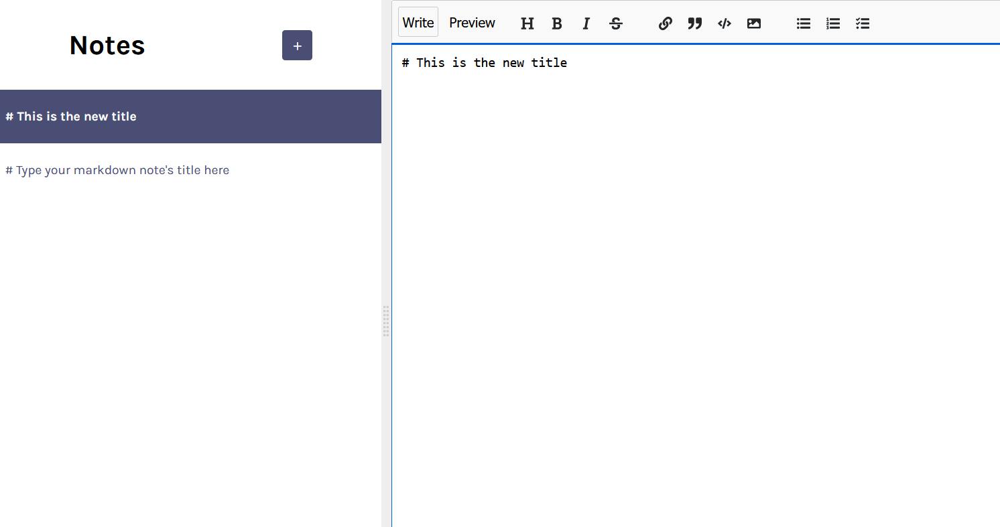

# MarkItDown

MarkItDown is a simple, user-friendly Markdown editor built with React⚛️ and Firebase🔥. It allows users to write and preview Markdown content in real-time, making it easier to format text for various purposes such as documentation, notes, or blog posts.

It also features Firebase Auth with Google sign-in.

This project is part of Learn React course on [scrimba.com](scrimba.com).

## Demo



[Live Demo](https://rushil-markitdown.netlify.app/)

## Features

- Live preview of Markdown content
- User-friendly interface
- Firebase integration for data storage and authentication
- Google sign in functionality to save notes

## Installation

To run this project locally, follow these steps:

1. **Clone the repository:**

   ```bash
   git clone https://github.com/RushilJalal/MarkItDown.git
   ```

2. **Navigate to the project directory:**

   ```bash
   cd MarkItDown
   ```

3. **Install the dependencies:**

   ```bash
   npm install
   ```

4. **Set up Firebase:**

   - Create a Firebase project at [Firebase Console](https://console.firebase.google.com/).
   - Add a new web app to your Firebase project.
   - Copy your Firebase configuration and replace the placeholder configuration in the project at [firebase.js](src\firebase.js)

5. **Start the development server:**

   ```bash
   npm run dev
   ```

   The app should now be running on `http://localhost:5173`.

## Usage

- Sign in with Google
- Write Markdown in the editor pane.
- See the rendered Markdown preview in real-time in the preview pane.
- Use the toolbar for common Markdown syntax shortcuts.

## Contributing

Contributions are welcome! Please fork the repository and use a feature branch. Pull requests are gladly accepted.

1. Fork the repository
2. Create your feature branch (`git checkout -b feature/YourFeature`)
3. Commit your changes git commit -m 'Add some feature'`)
4. Push to the branch (`git push origin feature/YourFeature`)
5. Open a pull request

## Acknowledgements

This project is part of Learn React course on [scrimba.com](scrimba.com). Special thanks to the course instructors for their guidance and resources.
